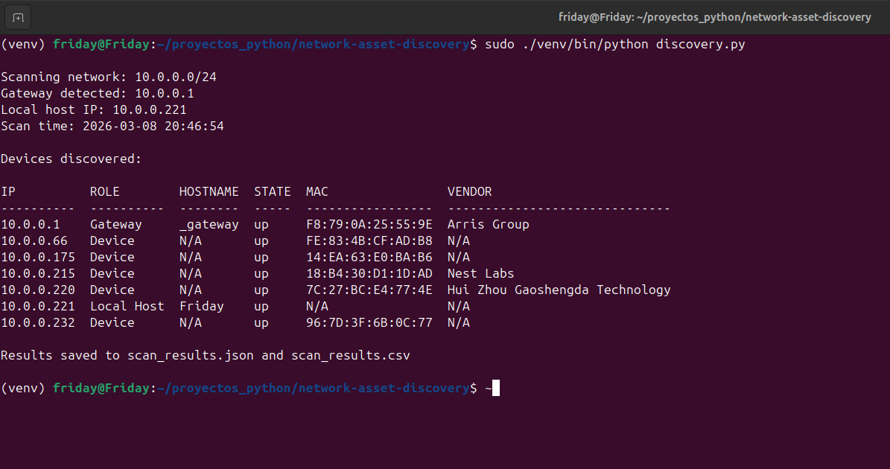

# Network Asset Discovery Tool

A Python-based network discovery and inventory tool designed for IT, networking, and cybersecurity learning.

This tool scans a local network and builds a simple inventory of connected devices including IP addresses, device roles, open ports, and operating system guesses.

The goal of this project is to practice:

- Linux networking
- Python scripting
- automation
- network enumeration
- cybersecurity fundamentals

---

# Features

The tool performs multiple analysis phases to discover and analyze devices on a network.

## Phase 1 — Network Discovery

- Automatically detects the local network
- Detects the default gateway
- Detects the local host IP
- Uses Nmap ping scan to identify active hosts

## Phase 2 — Device Classification

For every discovered host the tool identifies:

- IP address
- device role (Gateway, Local Host, Device)
- guessed device type
- hostname
- device state
- MAC address
- hardware vendor

## Phase 3 — Common Port Scanning

The tool scans common ports:

- 22 (SSH)
- 53 (DNS)
- 80 (HTTP)
- 443 (HTTPS)
- 445 (SMB)
- 3389 (RDP)
- 554 (RTSP)

Ports are displayed with their common service name.

Example:

80(HTTP), 443(HTTPS)

## Phase 4 — Selective OS Detection

Operating system detection is performed using Nmap OS fingerprinting.

To keep the scan fast, OS detection only runs when:

- the device is the Gateway
- the device is the Local Host
- the device has open ports

If OS detection is skipped the table shows:

Skipped

OS results are simplified for readability.

Examples:

Linux  
Windows  
macOS / iOS  
Router / Network OS  
Unknown

---

# Example Output

Below is an example scan of the tool running on a local network.

Example terminal output:

IP          ROLE        DEVICE_TYPE               OS_GUESS  HOSTNAME  STATE  OPEN_PORTS
----------  ----------  ------------------------  --------  --------  -----  -----------------------------
10.0.0.1    Gateway     Gateway / Router          Linux     _gateway  up     53(DNS), 80(HTTP), 443(HTTPS)
10.0.0.57   Device      Computer / Laptop         Skipped   N/A       up     None
10.0.0.221  Local Host  Local Computer            Linux     Friday    up     None

The scan results are also exported to files.

---

# Output Files

After each scan the tool generates:

scan_results.json  
scan_results.csv

These files allow the scan data to be used for:

- asset inventory
- reporting
- automation
- analysis

---

# Requirements

This tool requires:

Python 3  
Nmap  

Python libraries:

python-nmap

---

# Installation

Clone the repository:

git clone https://github.com/profjlr-spec/network-asset-discovery.git  
cd network-asset-discovery

Create a virtual environment:

python3 -m venv venv

Activate it:

source venv/bin/activate

Install dependencies:

pip install -r requirements.txt

Install Nmap if needed:

sudo apt install nmap

---

# Usage

Run the tool with automatic network detection:

sudo ./venv/bin/python discovery.py

You can also scan a specific network:

sudo ./venv/bin/python discovery.py --network 192.168.1.0/24

---

# Project Purpose

This project was built as a learning exercise to develop skills in:

- Python scripting
- Linux networking
- network discovery
- IT automation
- cybersecurity fundamentals

---

# Learning Goals

The project demonstrates practical use of:

- Nmap automation with Python
- network host discovery
- port scanning
- OS fingerprinting
- structured data export (JSON / CSV)

---

# Future Improvements

Possible future versions may include:

- service detection
- device fingerprinting improvements
- vulnerability detection
- web dashboard
- network topology mapping
- automated asset inventory system

---

# Author

Juan Ramos

IT Support / Linux / Networking / Cybersecurity Learning Project
